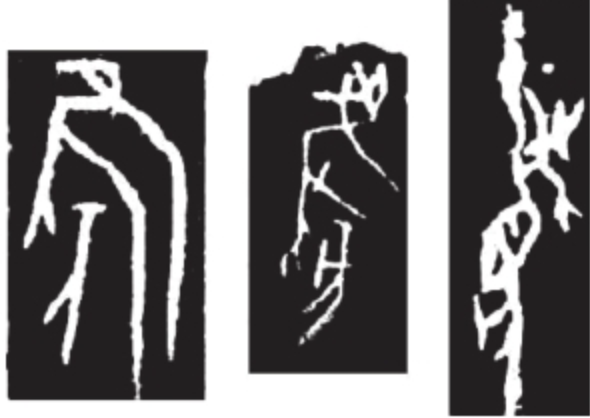
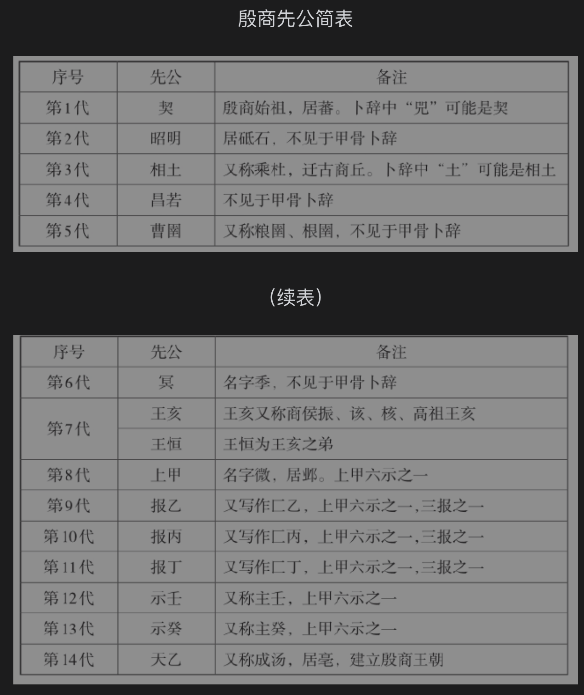
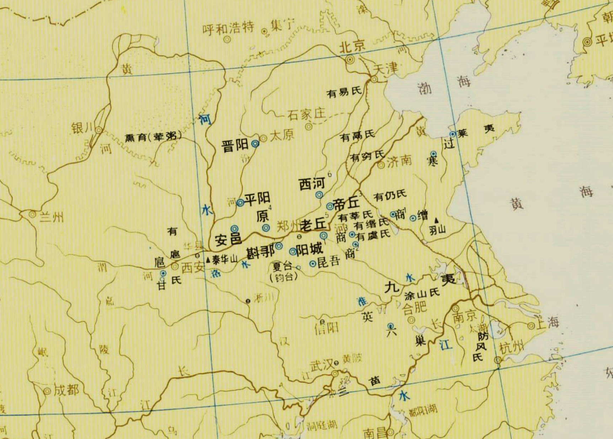
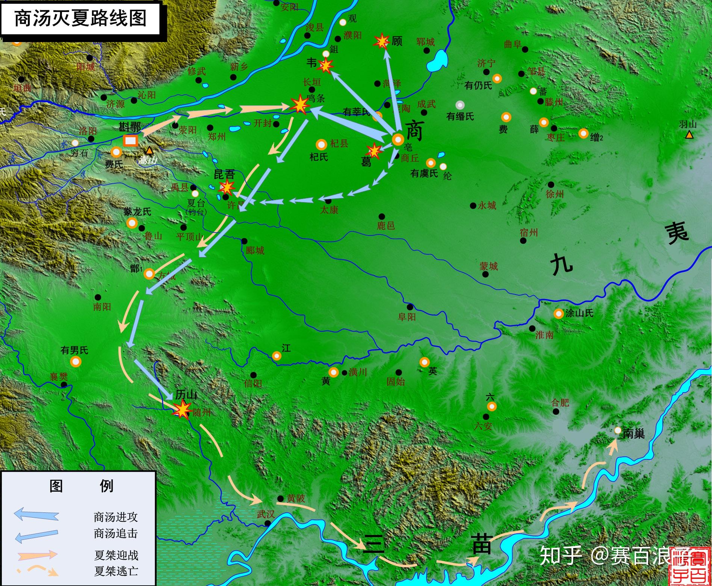

# 《殷商六百年》阅读大纲

## 商人从何而来
### 商人的鸟图腾崇拜
- 《史记·殷本纪》：殷契，母曰简狄，有娀氏之女，为帝喾次妃。三人行浴，见玄鸟堕其卵，简狄取吞之，因孕生契。
- 《诗经·商颂》：天命玄鸟，降而生商，宅殷土芒芒。
- 《楚辞·天问》：简狄在台，喾何宜？玄鸟致贻，女何喜。

商甲骨卜辞中的王亥形象也类似于一个人在吃鸟的头

王亥食鸟头、简狄吞鸟卵，都是商族渴求获取自然神力的一种表象，很明显早期的商族中曾经盛行着鸟图腾崇拜

### 商人来源
华北燕山地带的戎狄部落是商族的族源之一。

契的母亲简狄来自有娀氏，根据《淮南子·地形训》记载，有娀氏在不周山以北，有二女，长女叫简翟，次女叫建疵。

除了北方戎狄部落，黄河下游的东夷族也对商族的形成与发展产生了重大影响。司马迁称有娀氏之女为帝喾次妃，说明有娀氏与帝喾联姻过。

东夷族是一个典型的鸟图腾崇拜的民族，因此商人的鸟图腾崇拜很可能来源于东夷族。

### 共工与商人的关系
历史事件：约公元前2200年，鼎盛的后冈二期文化突然在豫北平原消亡了。而在辽西、内蒙古东南、冀北一带，崛起了文化内涵与后冈二期文化极为相似的夏家店下层文化。这几乎是同时间的一兴一亡事件，其中必然有内在的逻辑联系

作者认为，后冈二期文化千里北徙反映的是“流共工于幽州”的历史记载，后岗二期文化可能与史传的共工氏有关。
- 《尚书·尧典》：流共工于幽州

**共工氏的罪恶**
1. 史前大洪水

    《淮南子·天文训》：“昔者共工与颛顼争为帝，怒而触不周之山，天柱折，地维绝。天倾西北，故日月星辰移焉；地不满东南，故水潦尘埃归焉。”

    古代黄河经常改道，而共工氏深受其害，因此史传文献中有很多关于共工氏治水的传说。
    共工氏采取的措施是挖肉补疮，削平高丘，土壤用来堙塞低洼，以绝水患。结果上游的洪水受堵四溢，临近的各部落大受其害，怨声鼎沸。

2. 干预禅让制度

    尧禅让王位给舜，共工极力反对。
    >《韩非子·外储说右》：“尧欲传天下于舜，鲧谏曰：不祥哉，孰以天下而传之于匹夫呼。尧不听，举兵而诛杀鲧于羽山之郊。共工又谏：孰以天下而传之于匹夫呼。尧不听，又举兵而诛共工于幽州之都。”

    共工反对尧禅让王位的记载只见于《韩非子》，不保真。《韩非子》记载尧举兵将共工诛杀在幽州之都，而《史记·五帝本纪》记载“舜而归言上帝，请流共工于幽陵，以变北狄”；

    而且历史上关于尧是否真将王位禅让给舜还是舜囚禁了尧抢夺了王位还有所争议

    >《竹书纪年》：“舜囚尧，复堰塞丹朱，使不与父相见也。”

**共工氏与殷商的关系**

雁门以北、岱海附近的内蒙古东南、冀北等广大地区，地形复杂，或莽原山川，或戈壁黄沙，古属于幽州。传说中的不周之山、有娀氏，也都位于这一带。

作者在书中写到，“史书虽未明载，但有理由相信，有娀氏与流徙幽州的共工氏一定存在某种关联，二者都与商族关系密切，甚至是亲族。”（这一没史料，二没考古发现，作者是怎么敢说这个结论的啊 😅）

## 先商文化
考古学上把成汤灭夏之前以商族为主体所创造的文化称为先商文化。

先商时期的商族首领确知的有十三位，即契、昭明、相土、昌若、曹圉（又称粮圉、根圉）​、冥（又称季）​、王亥（又称振、该、核）​、上甲（又称微）​、报乙、报丙、报丁、示壬（又称主壬）​、示癸（又称主癸）​。

### 契
甲骨文中有个字形，上端是颗奇异的脑袋，下端是侧立或侧跪的人形，通常释读为兕(sì)。兕经常被殷人祭祀，不但是祖先神，而且还是能够呼风唤雨的自然神，学者们认为他就是商族的始祖——契。

契的根据地——番坐落在太行山东麓的冲积扇上，这里是孕育古文明的摇篮。契的时代，商族的生活习性与北方戎狄相近，过的是半农半牧、狩猎的日子。

### 昭明&相土
昭明把根据地从番迁徙到砥石。砥石，位于今天河北泜河流域，在番南边大约110千米处。

泜河两岸丰美的水草、湿润的气候，让商族拥有成群的膘肥体壮的马、牛、羊。
到了昭明之子相土时，商族有了大发展。由于畜牧业发达，相土驯养马匹，制作车乘，用来运输货物，开始从事原始商业活动。但与夏人广筑宫室、以耕作为业的定居生活相比，仍然有着天壤之别。
>《世本·作》：相土作乘马。 《竹书纪年》：“帝相十五年，商侯相土作乘马，遂迁于商丘”

作者认为，“商族的不断迁徙可能与全新世晚期气候的反复有关”。

在史传文献中，最早记载的商业行为和贸易事件就产生于驾驭牛车、云游四方的商族部落。殷商先公王亥也被誉为“商业的鼻祖”​。

作者认为，相土南迁的古“商丘”就是今河南濮阳。具体的依据可以参看原书，主要是来自水经注的记载：“河水旧东决，迳濮阳城东北，故卫也，帝颛顼之墟。昔颛顼自穷桑徙此，号曰商丘，或谓之帝丘，本陶唐氏之火正阏伯之所居，亦夏伯昆吾之邦，相土因之。​”

相土南迁之后，商族就活跃于豫北冀南平原。

### 冥
>《竹书纪年》：“帝少康十一年，使商侯冥治河。帝杼十三年，商侯冥死于河。” 

>《礼记·祭法》郑玄注：​“冥，契六世之孙也。其官玄冥，水官也。​”

冥治河，死于河，故被夏人尊为河神。河神，是保佑农业丰收的自然神。

### 王亥&王恒
王亥在殷商民族心目中形象崇高，被殷商民族尊称为“高祖”​。

王亥之父冥治河，死于河，那时候黄河不由山东入海，而是流经河北邯郸等地，在天津的宁河注入渤海湾。

>《世本》：“胲作服牛。”

王亥驯服了牛，发明了牛车，这一行为对当时商部落的经济发展和物资运输产生了极其重要的影响。这不仅解决了马在当时使用中面临的困境，如数量不足、饲养困难等问题，还为商部落的物资交换和贸易活动提供了新的运输方式。

>《天问》：“该秉季德，厥父是臧。​” 

该即王亥，季是冥的私名。这句话说明王亥继承了父亲冥兢兢业业的美德

王亥在前往有易氏部落进行交易的时候客死异乡（《山海经·大荒东经》：“王亥托于有易、河伯仆牛”），关于王亥死因的真相有以下几种说法：

1. **有易氏贪财，杀人越货**
   
    >《山海经·大荒东经》中说：​“有易杀王亥，取仆牛。​”

2. **王亥勾引有易氏之女, 伤风败德**

    >《天问》：“干协时舞，何以怀之？平胁曼肤，何以肥之”

    >《古本竹书纪年》：“殷王子亥宾于有易而淫”

    这个观点受到了屈原的反驳，《天问》云：​“有扈牧竖，云何而逢？击床先出，其命何从？​”意思是说，王亥与有易之女在交媾，怎么会如此凑巧被有易氏的牧人发现？牧人趁着黑夜对王亥下手，刺杀的命令又是谁发出的？

    我认为，这个王亥偷着跟有易氏之女啪啪被发现是迟早的事，所以屈原的这段问句是不太合理的，有易氏之君很有概率发现了这件事然后密谋除去王亥。
    
    王亥伤风败德这个观点靠不住的真实原因应该是：1. 王亥受到殷商后人无比的崇敬，地位非常之高，不像是一个私德有问题的人（不过上古有关于德的概念吗？商人祭祀会看自己的先祖有没有德行吗？）。屈原在《天问》中也说了王亥是一个兢兢业业的人；2. 王亥作服牛证明这个人不傻，他在有易氏国君的眼皮子底下搞他女儿，而且还屡犯不合常理，正常联姻就好了没必要偷偷摸摸乱搞。

3. **王亥觊觎有易氏的财富及土地，试图通过诱惑有易氏之女，并吞有易氏**

    个人赞同这个观点，比较合理。

    王亥死状之惨，令人不忍一睹。​《山海经·海内北经》中云：​“王子夜（即王子亥）之尸，两手、两股、胸、首、齿，皆断异处。​”

    >《周易》:“鸟焚其巢，旅人先笑后号啕，丧牛于易”​。

    鸟和旅人都暗指王亥，指王亥先得到了有易氏之女高兴发笑后被有易氏偷袭命丧黄泉。

关于王恒的记载只见于《天问》：“恒秉季德，焉得夫朴牛？何往营班禄，不但还来？”

有易氏杀了王亥之后将他的弟弟王恒立为国君，并承接了他哥哥的财产（成群的牛羊）。恒成了商族首领，却不得人心。王恒被迫逃到班禄（地望不详）去，从此消失得无影无踪了。或说，班禄是指有易之君绵臣颁发给恒的爵禄，王恒由此大失民心。

安阳殷墟重见天日之后，在卜辞上发现了一个不见于史传文献的殷商先王——王亘。如有条卜辞云：​“贞勿侑于王亘。​” 清代学者王国维指出，卜辞中的“王亘”就是《天问》中的王恒

### 上甲微
>清华简《保训》：昔微假中于河，以复有易，有易服厥罪，微无害，乃归中于河。微志弗忘，传贻子孙，至于成汤。​”

这里的中，作者认为是中庸之道的意思，即为人处世都要讲究原则，实事求是。

上甲微的中道一直传承了下去。商汤时，上甲微的中道确立为殷商的执政理念。所以，​《孟子·离娄下》中说：​“汤执中，立贤无方。​”

**上甲微的贡献**
1. 灭有易氏，确立中道思想
2. 开启商族的信史时代
   
    上甲微的时代，是殷商民族脱胎换骨的时代，首先开启了商族的信史时代。

    上甲微之时不但有典册，而且设置了负责记录事件、载入典册的专业官员；除了史官，还有负责祭祀、占卜的专业集团——贞人，意味着上甲微时期初步确立了官制。

3. 塑造了商人的精神世界

   殷商民族祭祀的第一个近祖就是上甲微。人在合祭殷商先祖时，都是从上甲微开始的

   国之大事，在祀与戎。祭祀天地神灵、祖宗，成了殷商王朝政治生活中的头等大事。祖甲之后，商朝形成了一个严密、有规律的祭祀制度——周祭或周祀

4. 殷商第一个以天干为庙号的先公

上甲微作为殷商政治制度的奠基人，以及精神世界的引领者，无疑是殷商最重要的先王之一。殷商后人对上甲微的祭祀，有燎祭、侑祭、御祭、肜祭、报祭等，种类多，规格高。

## 夏朝的建立

自契至成汤八迁的四个世纪内，黄河中下游地区发生了翻天覆地的变化。临汾盆地的陶寺文化衰亡了，曾经威赫一时的有唐氏在内乱中被消灭了。
环嵩山地区的有夏氏之君大禹通过治理大洪水，树立了绝对的权威，取代唐尧、虞舜，成为中原各氏族部落的共主。

《史记·殷本纪》中记载商朝的祖先契跟随大禹治水有功，应当是后人虚拖之词，此时夏商两国距离过远在上古时期是不可能碰面的。

关于夏朝的建立，有几种不同的说法：
1. **《史记·夏本纪》：“三年之丧毕，益让帝禹之子启，而辟居箕山之阳。禹子启贤，天下属意焉。及禹崩，虽授益，益之佐禹日浅，天下未洽。故诸侯皆去益而朝启，曰：​“吾君帝禹之子也。​”于是启遂即天子之位，是为夏后帝启。”**

    从上面的记载可以看出，《史记》的观点是禹将王位禅让给了伯益，但是诸侯觉得伯益资历太浅并且启有很贤明，因此大家都来归附启，从而开启了夏王朝。

2. **《韩非子·外储说右下》记载：“言禹传位于益，终令启取之。” 《战国策·燕策一》：“禹授益，而以启人为吏。及老，而以启为不足任天下，传之益也。启与支党攻益，而夺之天下，是禹名传天下于益，其实令启自取之。”**
   
   《韩非子》&《战国策》认为，大禹并不是真心想要传位给益，而且启的帝位是通过手下诸侯经过权利争夺得来的。

   我个人更加倾向于这种观点，毕竟在上古时期人们还没有什么道德的观念，谁都想当部落头头，不可能有你让我让这种和谐景象出现的，都是后人强行附会罢了。

3. **《天问》：“启代益作后，卒然离蠥。何启惟忧，而能拘是达？皆归射鞠，而无害厥躬。何后益作革，而禹播降？”**
   
    屈原认为启想取代伯益而做国君，没想到会忽然遭到灾难（被拘禁）​，却又从拘禁之中逃脱出来，伯益的弓箭手向启交出武器，以示投诚。这可能也是在说明启的势力比较大，伯益不得不向启投降。
    
### 启建夏朝
1. 继承禹的王位
2. 钧台之享
    
    启夺得王位后，为了废除传统的禅让制、巩固王权、确立王位世袭，召集了各地方国首领，举行了一场盛大的献祭神灵的活动，即 “钧台之享”。这次活动也是一次重要的方国盟会，确立了夏启的 “共主” 地位。

3. 灭有扈氏
   
   >《史记·夏本纪》：有扈氏不服，启伐之，大战于甘。将战，作《甘誓》。

   >《吕氏春秋・先己》：“夏后相与有扈氏战于甘泽而不胜，六卿请复之，夏后相曰：‘不可。吾地不浅，吾民不寡，战而不胜，是吾德薄而教不善也。’于是乎处不重席，食不贰味，琴瑟不张，鼓瑟不修，子女不饬，亲亲长长，尊贤使能，期年而有扈氏服。”

   《吕氏春秋》的记载体现出启懂得反思自己的所作所为，是一个比较贤能的君主。而本书的作者通过启的“吾德薄而教不善”推断出启是一个德薄的君主，就nmd的离谱，作者没仔细看原文吧🙃

4. 造九鼎
   
   一般认为九鼎是禹铸造的，最早的记载见于《左传》：“禹铸九鼎于荆山，铸鼎象物，百物而为之备，使民知神奸”。

   但是《墨子・耕柱》：“昔者夏后开使蜚廉折金于山川，而陶铸之于昆吾”指出铸造九鼎的是夏后启，本书的作者采信了这种说法来佐证夏启是“薄德”君王的观点（看看图个乐）。

### 太康失国
《史记·夏本纪》：“夏后帝启崩，子帝太康立。帝太康失国，昆弟五人，须于洛汭，作《五子之歌》。”

关于太康失国以及少康复国的有关材料：据《左传》哀公元年、古本《竹书纪年》及《帝王世纪》佚文的记载，夏帝太康时，有穷氏首领羿取代夏政，但羿宠信伯明氏之寒浞，浞杀羿而执政。

太康之后，经帝中康，中康子相投靠同姓斟鄩氏和斟灌氏。寒浞使其子浇灭斟灌氏和斟鄩氏，杀夏相。相妃为有仍氏女后缗，其时方娠，逃归有仍，生子少康。

少康年长后，夏旧臣靡收斟灌氏和斟鄩氏之遗民，攻灭寒浞，立少康，少康又灭浇于过，其子杼灭浇之弟豷于戈，有穷氏遂灭，少康乃复夏政。

### 少康中兴
少康将都城从斟鄩迁至阳翟，由于东夷穷、寒二氏的破坏，中原地区陷入了超过半个世纪（可能不止史书上所说的四十年）的混乱局面，在少康复国成功之后，建立了新秩序。中原地区的方国、部落都尊奉少康为共主，将大禹、启等夏朝先王与天一起祭祀。少康因此被视为继大禹之后又一位夏族英主。

李伯谦认为，新砦期遗存即是文献所记“后羿代夏”至“少康中兴”事件的物质遗存

### 杼
>《古本竹书纪年》：“柏杼子征于东海，及王寿，得一狐九尾”​。

> 《国语·鲁语上》云：​“杼，能帅禹者也，夏后氏报焉。​”

报祭，就是报德之祭，为报答先祖、神灵举行的祭祀活动。大禹之后的十六个夏王中，唯杼一人获此殊荣，可见帝杼在夏人的心目中威望极高。

### 夏商并立之势
《古本竹书纪年》记载，夏王帝泄二十一年，​“命畎夷、白夷、赤夷、元夷、风夷、阳夷”​。

帝泄之后，其子帝不降继位。帝不降六年，西征九苑。

帝不降三十五年，殷商灭皮氏。皮氏，在今山西黄河与汾河交汇处的河津一带。可见，商族的势力已经翻越太行山脉，深入山西南部的临汾盆地。此时商族势力可以从北方威胁到夏王朝（夏在洛阳盆地，商已经越过了太行山）

[ ]这段我在地图上没看懂，商大概在夏的东南方向，夏靠近太行山地处洛阳盆地，商是怎么绕到夏北面去翻过太行山灭皮氏的？如果当时商领土已经这么大了，夏朝不可能不提防啊？

帝廑又名胤甲，把都城迁到西河（今河南汤阴至内黄一带）​。夏王朝的统治中心已经逼临商族活跃的核心区域——漳河流域，两者之间的距离只有一条黄河的宽度了。

### 孔甲
>《史记·夏本纪》：“帝孔甲立，好方鬼神，事淫乱。夏后氏德衰，诸侯畔之。天降龙二，有雌雄，孔甲不能食，未得豢龙氏。陶唐既衰，其后有刘累，学扰龙于豢龙氏，以事孔甲。孔甲赐之姓曰御龙氏，受豕韦之后。龙一雌死，以食夏后；夏后使求，惧而迁去。”

这段记载是说孔甲发现了雌雄两条鳄鱼，到处寻找饲养鳄鱼的豢龙氏（可以看出上古人世代分职不同的职业），但是豢龙氏已不知去向，有人把刘累推荐给孔甲。

刘累颇得孔甲欢心，于是被封为御龙氏，取代了豕韦氏。

刘累离开滑县之后，颛顼后裔彭姓的豕韦氏得以复国。豕韦氏不念旧恶，忠诚于夏王，与顾、昆吾并称为夏末三大方国，拱卫着夏朝的东方门户，抵御商汤的进攻

>《左传·昭公二十九年》中载：​“及有夏孔甲扰于有帝，帝赐之乘龙，河、汉各二，各有雌雄。​”杜预注云：​“孔甲，少康之后九世君也，其德能顺于天。​”

这段记载或许能为孔甲正名，并不是像史记说的那样淫乱不堪。

